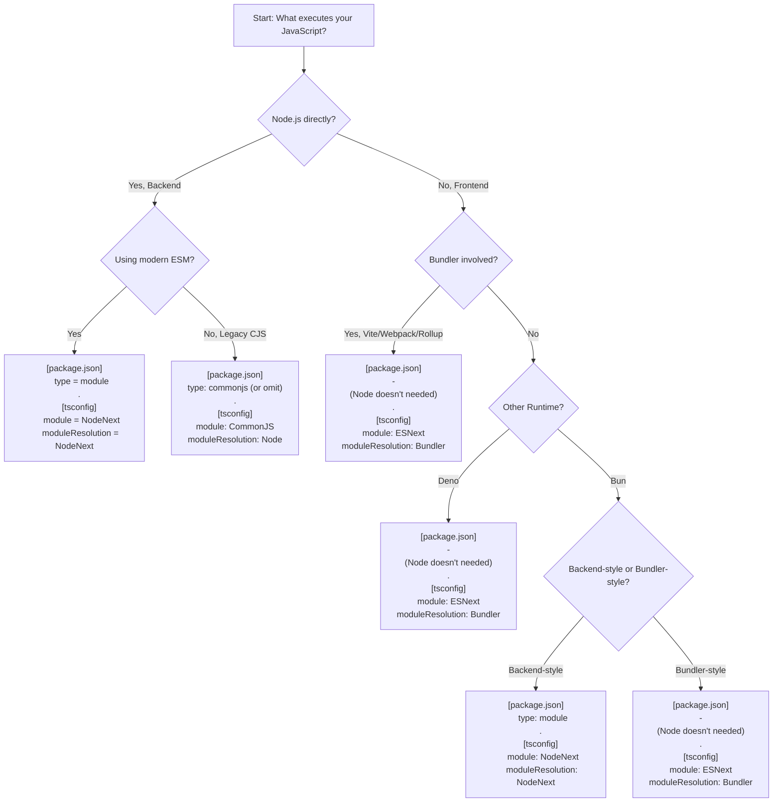

# TypeScript Modules & Runtimes — Practical Guide



---

# ECMAScript

**ECMAScript** is the official language specification that defines JavaScript.

It is maintained by **TC39** (Technical Committee 39) under Ecma International.

It defines:

- Syntax (`if`, `class`, `import`, etc.)
- Semantics (how code behaves)
- Types (`Number`, `String`, `Object`, etc.)
- Functions and closures
- Modules (ESM system)
- Execution model (call stack, jobs, promises)
- Standard built-in objects (`Array`, `Map`, `Promise`, etc.)

It does **NOT** define:

- The DOM
- Browsers
- Node.js APIs
- File systems
- HTTP
- `console.log`
- `setTimeout`

Those are provided by **host environments** (e.g., browsers, Node.js, Deno, Bun).

ECMAScript defines the language.
Hosts provide the runtime environment.

---

# TypeScript `module`

`module` tells TypeScript:

> What module system should the emitted JavaScript use?

It controls:

- Whether output uses `require()` or `import`
- Whether `exports` or `export` is generated
- How dynamic `import()` is emitted
- What interop helpers are added

It determines the **module format of the generated JavaScript**.

---

## Example Input (used in the following module options)

```ts
import { readFile } from "fs";
export const x = 1;
```

---

## `module: "CommonJS"`

Emits classic Node-style CommonJS modules.

Output:

```js
"use strict";
Object.defineProperty(exports, "__esModule", { value: true });
exports.x = 1;

const fs_1 = require("fs");
exports.x = 1;
```

Uses:

- `require()`
- `module.exports`
- `exports`

Use when:

- Running legacy Node.js
- Using `"type": "commonjs"`
- Maintaining older CJS projects

---

## `module: "ESNext"`

Preserves native ECMAScript module syntax.

Output:

```js
import { readFile } from "fs";
export const x = 1;
```

TypeScript does not transform imports/exports.

Use when:

- A bundler (Vite, Webpack, Rollup, esbuild) handles output
- Targeting Deno
- Targeting modern runtimes that understand ESM
- You want the bundler to decide final format

Important:

`ESNext` does **not** mean “Node-style ESM”.
It means “emit standard ECMAScript modules”.

---

## `module: "NodeNext"`

This mode mirrors **modern Node.js module behavior** (Node 16+).

It:

- Respects `"type": "module"` in `package.json`
- Distinguishes `.mts` (ESM) and `.cts` (CJS)
- Emits ESM or CJS depending on file type and package configuration
- Matches Node’s dual ESM/CJS system

NodeNext is not just about syntax preservation —
it makes TypeScript behave like Node’s real module system.

Use when:

- Running directly in Node.js (modern versions)
- Building backend applications
- You want TypeScript resolution + emit to match Node exactly

---

# TypeScript `moduleResolution`

`moduleResolution` controls:

> How TypeScript finds and resolves imported module paths during type-checking.

It determines:

- How `"./utils"` is mapped to a file
- Whether extensions are required
- How `package.json` fields are interpreted
- How `"exports"` and `"imports"` maps are handled

This affects **type resolution**, not emitted syntax.

---

## `moduleResolution: "Node"`

Legacy Node resolution (CommonJS-era).

- Extension guessing (`.ts`, `.js`, `.d.ts`)
- Does not fully support modern `exports` maps
- Matches older Node behavior

Use only with:

```
module: "CommonJS"
```

Legacy projects only.

---

## `moduleResolution: "NodeNext"`

Modern Node resolution algorithm.

Understands:

- `package.json` `"exports"`
- `package.json` `"imports"`
- Conditional exports (`import` vs `require`)
- ESM strict extension rules
- `.mts` / `.cts`

This matches how Node 16+ resolves modules.

Required when using:

```
module: "NodeNext"
```

---

## `moduleResolution: "Bundler"`

Designed to match bundlers.

It:

- Allows extensionless imports in ESM
- Does not enforce Node’s strict ESM extension rules
- Assumes bundler rewrites paths
- Supports modern package `exports` flexibly

Example:

```ts
import "./utils";
```

Node ESM requires:

```ts
import "./utils.js";
```

Bundlers do not.
So `Bundler` avoids false TypeScript errors.

Use when:

- Using Vite
- Using Webpack
- Using Rollup
- Using esbuild
- Targeting Deno

---

# Key Distinction

| Option             | Controls                                      |
| ------------------ | --------------------------------------------- |
| `module`           | How JavaScript is emitted                     |
| `moduleResolution` | How imports are resolved during type-checking |

They solve different problems.

---

# Correct Combinations

| Runtime                | module   | moduleResolution |
| ---------------------- | -------- | ---------------- |
| Legacy Node (CJS)      | CommonJS | Node             |
| Modern Node (ESM)      | NodeNext | NodeNext         |
| Bundler (Vite/Webpack) | ESNext   | Bundler          |
| Deno                   | ESNext   | Bundler          |
| Bun (Node-style)       | NodeNext | NodeNext         |
| Bun (Bundler-style)    | ESNext   | Bundler          |
