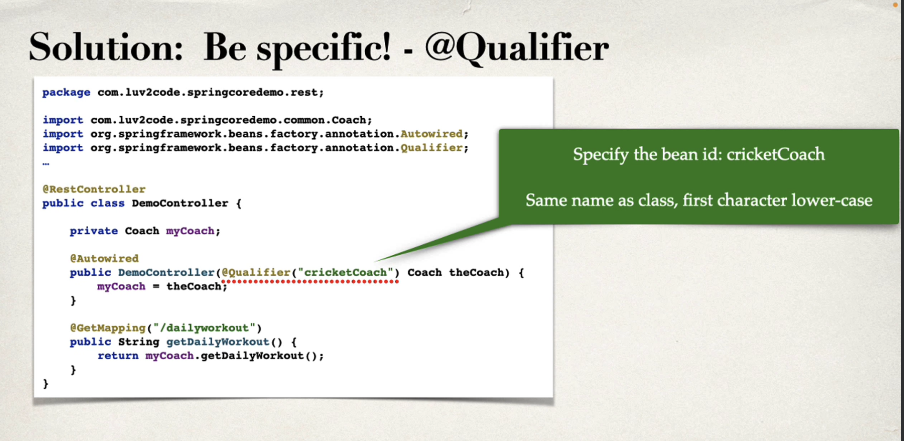

# SpringBoot

### Description

SpringBoot is a Java Boilerplate Framework for a quick start.

You can use SpringBoot by:

- Creating a project on https://start.spring.io
- Creating a project using the VSCode SpringBoot Initializer extension

Tipp:
Add the "Web" (Web Framework) and "SpringWebTools" (Development Features like hotreload) to the dependencies.

### Spring vs SpringBoot

Spring is a Java Framework, which is used by SpringBoot.

The difference is: SpringBoot comes with standard settings for quickly running a Java application, like webserver, configurations, dependency injections, etc...

### mvnw

mvn is a form of executing mvn without having it installed in your computer

### <build> element in pom.xml

In the past, a lot of plugins were needed to install an application.
They were registered there.

### How to run the app

Use one of following options:

- To run the App, navigate on VSCode to the file you want to run and click "Run"
- Execute `mvn spring-boot:run`

### Annotations in a SpringBootApplication

A characteristic of SpringBoot is the use of annotations

Annotations wrap class and methods and provide a custom way of configuring them.

Here, the idea is to let SpringBoot deal with the custom behaviours and configurations so that the developer can use his time to code.

### Servlet

Servlet is Java's basis for any server application you want to create.

### Autowiring

Autowiring is Spring's dependency injection.
Spring scan for @Components and injects them.

### Dependency Injection

- Via Constructor (Standard - mandatory dependency classes)
- - Here, you can use a @Qualifier annotation if you have multiple implementations of the same class:
    

- At the same time, the @Primary annotation points the default implementation
  

- Via Setter (Custom - optional dependency classes)
  

### Bean

- Bean is an object managed by Spring

### Bean scope

- Scope refers to the life cicle of a Bean: how is it created, how long they live; how they're shared
- Default scope is singleton
- Other scopes:
  

### Bean lifecycle

examples:

### Bean Configuration

Create new configuration

Inject it into the controller

- You can use the @Bean to transform a thirdy-party class into a SpringBean. Example:

# Marshalling with Jackson (Java POJO)

